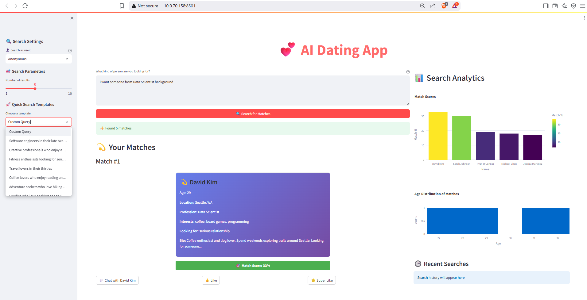

# AI Dating App 🤖💕

An intelligent dating platform that uses Natural Language Processing and Machine Learning to provide semantic profile matching and AI-powered conversation assistance.

## Interactive User Interface


## Features ✨

- **Natural Language Search**: Search for matches using everyday language instead of rigid filters
- **Semantic Matching**: AI understands the meaning behind profiles for better compatibility
- **Smart Conversation Starters**: AI generates personalized ice-breakers based on mutual interests
- **Intelligent Chat Assistant**: Get help crafting responses and maintaining engaging conversations
- **Real-time Compatibility Scoring**: See percentage match scores based on deep profile analysis

## Tech Stack

### Backend
- **FastAPI**: High-performance async web framework
- **Sentence Transformers**: Semantic embedding generation
- **Transformers**: Hugging Face models for chat assistance
- **Scikit-learn**: Similarity calculations and ML utilities
- **Pydantic**: Data validation and serialization

### Frontend
- **Streamlit**: Interactive web interface
- **Plotly**: Data visualization and analytics
- **Requests**: API communication

### ML Models
- **all-MiniLM-L6-v2**: Sentence embeddings for semantic search
- **DialoGPT-small**: Conversational AI assistance

## Architecture

```
AI Dating App/
├── app/                    # Backend FastAPI application
│   ├── api/
│   │   ├── endpoints/      # API route handlers
│   │   └── models/         # Pydantic schemas
│   ├── core/
│   │   ├── agents.py       # LLM processing agents
│   │   ├── config.py       # Configuration settings
│   │   └── tasks.py        # Background ML tasks
│   ├── services/
│   │   ├── dating_services.py  # Core matching logic
│   │   └── chat_services.py    # Chat AI functionality
│   ├── database/
│   │   └── users.json      # User profile storage
│   └── Dockerfile          # Backend container config
├── frontend/               # Streamlit frontend (to be created)
├── docker-compose.yml      # Multi-service orchestration
├── requirements.txt        # Python dependencies
└── README.md
```

## Quick Start

### Prerequisites
- Python 3.8+
- Docker and Docker Compose
- 4GB+ RAM (for ML models)

### Option 1: Docker Compose (Recommended)

1. **Clone the repository**
   ```bash
   git clone https://github.com/MehediHasan-ds/AI-Dating-App.git
   cd ai-dating-app
   ```

2. **Start the application**
   ```bash
   docker-compose up --build
   ```

3. **Access the services**
   - Backend API: http://localhost:8000
   - Frontend UI: http://localhost:8501
   - API Documentation: http://localhost:8000/docs

### Option 2: Local Development
1. **Clone the repo**
   ```bash
    git clone https://github.com/MehediHasan-ds/AI-Dating-App.git
    
    ```

2. **Configuration: Environment Variables**

  #### Create a `.env` file in the root directory:

   ```bash
    # API Configuration
    API_TITLE=AI Dating App
    API_VERSION=1.0.0
    DEBUG=false

    # Model Configuration
    EMBEDDING_MODEL_NAME=sentence-transformers/all-MiniLM-L6-v2
    LLM_MODEL_NAME=microsoft/DialoGPT-small

    # Database
    USERS_JSON_PATH=app/database/users.json

    # API Keys (optional for local models)
    OPENAI_API_KEY=your_openai_key_here
    HUGGINGFACE_API_KEY=your_hf_key_here

    # Search Configuration
    DEFAULT_TOP_K=5
    SIMILARITY_THRESHOLD=0.3
    
    ```

3. **Create virtual environment**
   ```bash
    python -m venv venv
    
    ```
4. **Activate virtual environment**
   ```bash
    # Windows:
    venv\Scripts\activate
    # macOS/Linux:
    source venvbin/activate
    
    ```

5. **Install dependencies**
   ```bash
   pip install -r requirements.txt
   
   ```

6. **Start the backend**
   ```bash
   uvicorn main:app --reload --host 0.0.0.0 --port 8000
   
   ```

7. **Start the frontend** (in another terminal)
   ```bash
   streamlit run frontend.py --server.port 8501
   
   ```
### ACCESS URLS

#### FastAPI Backend: http://localhost:8000
#### FastAPI Docs: http://localhost:8000/docs
#### Streamlit App: http://localhost:8501

## API Usage 📖

### Search for Matches
```bash
curl -X POST "http://localhost:8000/api/v1/dating/search" \
  -H "Content-Type: application/json" \
  -d '{
    "query": "looking for a creative professional who enjoys hiking and traveling",
    "user_id": "user123",
    "top_k": 5
  }'

```

### Generate Conversation Starter
```bash
curl -X POST "http://localhost:8000/api/v1/chat/starter" \
  -H "Content-Type: application/json" \
  -d '{
    "target_user_id": "user456"
  }'

```

### Get AI Chat Response
```bash
curl -X POST "http://localhost:8000/api/v1/chat/response" \
  -H "Content-Type: application/json" \
  -d '{
    "message": "What should I talk about with someone who loves photography?",
    "context": "They are a professional photographer who travels a lot"
  }'

```

### User Data Format

The application expects user data in JSON format. Example user profile:

```json
{
  "id": "user001",
  "name": "Alice Johnson",
  "age": 28,
  "location": "San Francisco, CA",
  "profession": "Software Engineer",
  "education": "BS Computer Science",
  "interests": ["hiking", "photography", "cooking", "travel"],
  "bio": "Love exploring new places and trying different cuisines. Looking for someone to share adventures with!",
  "relationship_type": "serious",
  "preferences": {
    "age_range": [25, 35],
    "distance": 50,
    "interests": ["outdoors", "technology", "food"]
  }
}

```

## Development 👩‍💻

### Project Structure
- `app/api/endpoints/`: API route handlers
- `app/services/`: Core business logic
- `app/core/agents.py`: AI processing agents
- `app/core/tasks.py`: ML computation tasks
- `app/database/`: Data storage


### Running Tests
```bash
# Install test dependencies
pip install pytest pytest-asyncio httpx

# Run tests
pytest tests/

```

## Performance 

### Benchmarks
- **Search Response Time**: 200-500ms (up to 10K users)
- **Conversation Starter**: 100-300ms
- **Chat Response**: 300-800ms
- **Memory Usage**: 2-4GB (includes ML models)

### Scaling Considerations
- Implement caching for embeddings
- Use batch processing for large user bases
- Consider GPU acceleration for production
- Database migration for large datasets


### Security Considerations
- Use environment variables for sensitive data
- Implement rate limiting for API endpoints
- Add user authentication and authorization
- Regular security updates for dependencies

## Troubleshooting 🔧

### Common Issues

**Models not loading**
- Check available memory (requires 4GB+)
- Verify internet connection for model download
- Check Hugging Face model availability

**Slow response times**
- Reduce user database size for testing
- Consider GPU acceleration
- Implement embedding caching

**API connection errors**
- Verify correct ports (8000 for backend, 8501 for frontend)
- Check firewall settings
- Ensure all dependencies are installed

---